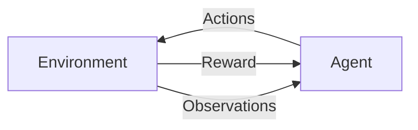

There are two important entities in [[Reinforcement Learning]] being the agent and environment. They communicate with each other via actions, rewards and observations

## Reward
Reward is a scalar value given by the environment to tell the agent how it is doing. It can be positive or negative, large or small, but it is a number. This is intended to tell the agent if it is performing well or not. We dont define how frequently an agent receives a reward. It can be every second or once in it's lifetime, although it is common to receive rewards every fixed timestamp, or at every environment interaction, for convenience.
The reward exists to give an agent feedback about its success. It is central to [[reinforcement learning]]. The reward should reinforce the agent's behaviour in a positive or negative way. Reward is local, in that it reflects the success of the agent's recent activity and not all successes achieved so far. Of course, getting a large reward for some action doesn't meant that a second later there won't be dramatic consequences. An agent will try to achieve the largest accumulated reward over its sequence of actions. These rewards can be artificially generated or found naturally in the problem.

## Agent
The agent is the thing that interacts with the envornment by executing actions, making observations and receiving eventual rewards. For most scenarios this is the software that is meant to solve the problem.

## Environment
This is everything outside of the agent for a problem that the agent is trying to solve. The agent communicates with the environment via the reward, action and observations.

## Actions
Actions are what an agent can do in an environment. They can be things such as, moves allowed in a game, or completing a task. They can be simple or complicated.
With RL there are two types of actions, discrete or continuous. Discrete are the finite set of mutually exclusive things an agent can do, such as move left or right. Continuous actions have a value attached such as the action of *turn the wheel* having an angle and direction of steering. Different angles can have different scenarios a second later, so just turning the wheel isn't enough.

## Observations
Observations are the second information channel for an agent, with the first being the reward. This is for convenience as the observations are the bits of information that provide an agent information about what's going on.

Observations can be relevant to upcming reward or may not be. They can include reward information in an obfuscated form such as score numbers on a screen.

Reward shouldn't be seen as a secondary or unimportant thing. Reward is the main driving force of learning. If a reward is wrong or noisy or slightly off course of the main objective, there is a chance training can go wrong.

It is important to distinguish between state and observation. The state of an environment potentially includes every atom in the universe which is impossible to measure everything. Even if the state is small, it will not be possible to get all the information about the environment