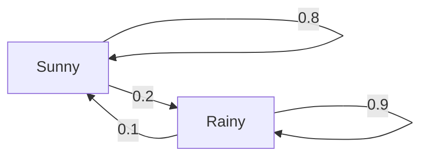

Imagine you have a system that you can observe. What you observe is called **states**, and the system can change states based on a set of laws. You cannot influence the system but only observe it and the states changing.

All possible states for the system form a set known as the **state space**. For Markov processes, this set is required to be finite (but can be very large). The observations form a sequence of states or a **chain** (which is why Markov processes are called Markov chains). For example, in looking at the weather in the city, we can see it as either *sunny* or *rainy* which is the state space. A sequence of observations over time forms a chain of states (ie. \[sunny, rainy, rainy, ...\]) which is called the **history**.

To call a system a Markov Process, it needs to fulfill the **Markov Property**, which means the future system dynamics need to depend on this state only. The main point of the Markov property is to make every observable state self-contained to describe the future of the system. Essentially, the Markov property requires the states to be distinguishable and unique from one another. In this case, only one state is needed to model future dynamics of the system and not the whole history.

In the case of the waether example, the Markov property limits the model to represent only the cases when a sunny day can be followed by a rainy one with the same probability, regardless of how many sunny days there were previously. That isn't very realistic as from commmon sense, we know the chance of rain depends on many other factors such as season, latitude etc. Of course, if we want to make the model more complex, we can do this by expanding the state space, which allows us to capture more dependencies in the model at a cost.

As a system complies with the Markov property, you can capture transition probabilities with a **transition matrix**, which is a square matrix of size NxN, where N is the number of states in a model. Each cell in row *i* and column *j* in the matrix contains the probability of the system to transition from state *i* to state *j*

For the weather example this can look like:
| | Sunny | Rainy |
| - | - | - |
| Sunny | 0.8 | 0.2|
| Rainy | 0.1 | 0.9 |

In this case, if we have a sunny day, then there is an 80% chance that the next day will be sunny and a 20% chance it will rain. If we observe a rainy day, then there is a 10% probability that it will be sunny the next day and 90% chance it will stay rainy.

So, the formal definition of a Markov Process is as follows:
- A set of states *S* that a system can be in
- A transition matrix *T*, with transition probabilities which defines the system's dynamics

A useful visual representation of a Markov Process is a graph with nodes corresponding to states and edges, labelled with probabilities representing a possible transition from state to state. If the probability is 0, we don't draw an edge.

This is still observation only. We cannot influence the weather so we observe it and record observations.

In practice, we rarely know the exact transition matrix. A much more real-world scenario is when we only have observations of our system's states, which are called **episodes**.

We can estimate the transition matrix from our observations. We count all transitions from every state and normalise them to the sum of 1. The more data we have, the closer our estimation will be to the real one.

The Markov property implies stantionarity (the underlying transition distribution does not change over time). Nonstationarity means that there's a hidden factor that influences the system's dynamics which is not included in the observations.
