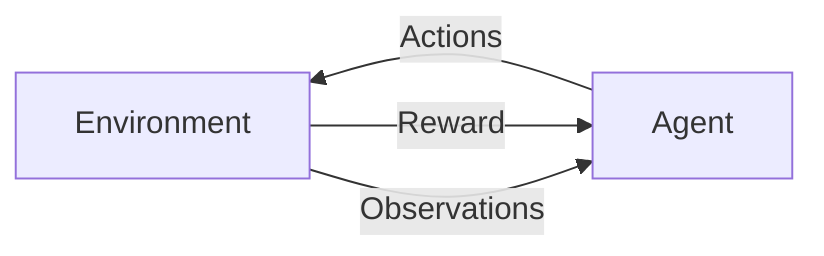

Reinforcement learning is a field of [[Machine Learning]] which aims to automatically learn optimal decisions over time. This lies between full supervision and a complete lack of defined labels. It uses many established methods of [[Supervised Learning]] such as [[Neural Networks]] for function approximation, [[Stochastic Gradient Descent]] and [[Backpropagation]] to learn data representation, but it applies them differently.

Reinforcement learning is a method of taking actions in an environment to relate the received reward with the action taken. We do not want to hard-code knowledge about an environment or the best actions to take in every situation. This would take too much effort and may become useless in the scenario of a slight environment change. Generality and flexibility is much more challenging than with Supervised or [[Unsupervised Learning]].

## Complications
Observation in reinformcement learning depends on the agent's behaviour and the result of its behaviour. If the agent acts inefficiently, then the observations tell nothing about what it has done wrong and how to improve. If the agent keeps acting wrong, then the observations will show that there is no way to get a larger reward, which could be wrong.
In machine learning tems, this can be rephrased as *non-i.i.d data*. I.i.d stands for **independent and identically distributed** which is a requirement for most supervised learning methods.

The second complication is that an agent needs to both *exploit* and *explore* its environment, because maybe doing something differently will improve the outcome. However, too much exploration can seriously decrease the reward (and an agent can forget what was learned before), so we need to balance between the two.

The third is that sometimes the reward can be delayed after actions. For example in chess, a strong move in the middle of the game can heavily influence the outcome in the end. During learning, we need to discover this relationship which can be tricky.

## Formalisms
Each field in science and engineering has its own assumptions and limitations. In supervised learning, this is the knowlege of input-output pairs. If you have no labels, you need to figure out how to get them or use something else. This doesn't necessarily make supervised learning good or bad, it just means it doesn't suit the problem. For anything we do we need to understand the limitations that we may face.

The two major entities in reinforcement learning are the agent and the environment. They communicate via the actions, rewards and observations.

